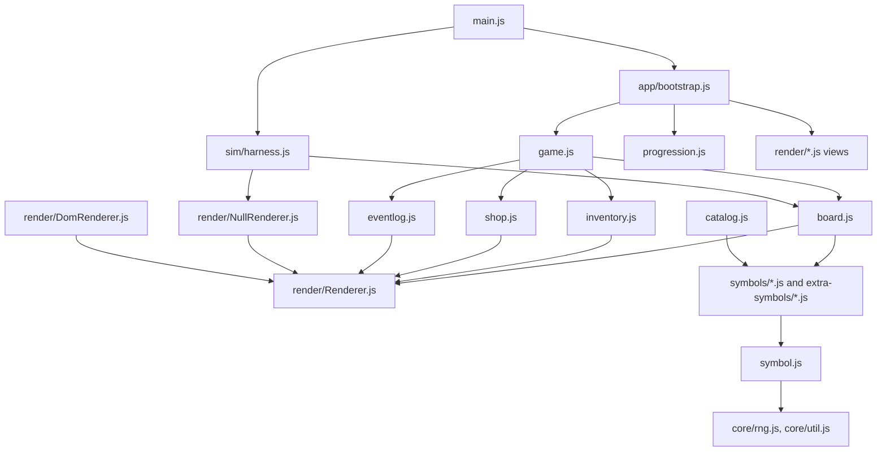

# Emoji Slots — Architecture

This document is a map of the codebase after the UI/game-logic separation
refactor. It covers where things live, how the pieces fit together, and what
test coverage exists.

## The one-sentence summary

Game logic (`Board`, `Inventory`, `Shop`, `Game`, `Progression`,
`GameSettings`, `Catalog`, `EventLog`, symbols) never touches the DOM
directly for rendering — it calls methods on an injected **Renderer**
object (`game.view`). `DomRenderer` implements those methods for real in
the browser; `NullRenderer` implements them as no-ops for headless
simulation. This is the "Humble Object" / port-adapter pattern: the
renderer is dumb and stateless about rules, the logic is dumb about
pixels.

## Module map

```
src/
  main.js              entry point: await bootstrap(); installSimulationHarness()
  app/
    bootstrap.js        composition root (RNG seed, Progression/GameSettings
                         wiring, first game load, sidebar wiring)
  core/
    rng.js               seeded RNG (sfc32), DOM-free
    util.js               pure helpers: formatBigNumber, parseEmojiString,
                          createInteractiveDescription
  render/                everything that touches `document`/DOM/CSS
    Renderer.js           abstract interface (every method throws "not implemented")
    DomRenderer.js         real browser implementation, delegates to the view classes below
    NullRenderer.js        no-op implementation for headless sim (see caveats below)
    BoardView.js           board grid DOM + cell animations
    InventoryView.js       inventory/resource panel DOM
    EventLogView.js        the ticker DOM
    ShopView.js             shop offer DOM + buy buttons
    ProgressionView.js     level-select chip DOM
    SettingsView.js         settings form DOM
    animations.js           animate/animateOverlay/drawText/createDiv/createSpan/
                            createInput/createButton + the ANIMATION flag
    layout.js               grid-scaling math (viewport-responsive board sizing)
  sim/
    harness.js              AutoGame (headless play driver) + window.simulate
  symbols/                 all buyable symbols, grouped by theme
    advanced.js animals.js food.js money.js music.js rocks.js
    things.js tools.js tutorial.js ui.js
  extra-symbols/           optional/example symbol packs
    beta.js example.js lock.js
  symbol.js                 Symb base class, chance()/badChance() helpers
  board.js                  Board model (cells, locks, rows, queries)
  inventory.js               Inventory model (owned symbols, resources)
  shop.js                     Shop model (offers, buy/refresh economy)
  catalog.js                  loads symbol source files, indexes by emoji/category
  eventlog.js                 thin wrapper over view.logResourceChange
  game.js                     Game: turn loop, ties board/inventory/shop/eventlog together
  progression.js               level list, save/load (localStorage), advancement
  game_settings.js             per-level settings data (board size, symbol sources, ...)
  consts.js                    shared emoji constants (MONEY, TURNS, LUCK, ...)
  util.js                     facade: re-exports core/rng.js + core/util.js + render/animations.js
```

### Dependency direction



`madge --circular src/` reports **zero circular dependencies** across all
40 modules. `symbols/*` and `extra-symbols/*` import only `symbol.js`,
`consts.js`, and `util.js` — never anything under `render/`.

## Key patterns

- **Renderer port** (`render/Renderer.js`): the abstract interface every
  concrete renderer implements — board spin/redraw/animate, inventory/
  resource rendering, shop rendering, event log, info panel, and the
  interactive-tool cell-picker (`pickCellForTool`). Grouped by subsystem,
  every method is `async` (or documented as such) so both a synchronous
  no-op and an animated DOM implementation satisfy the same contract.

- **`renderSpec`**: symbols never build DOM. `Symb.renderSpec(game, x, y)`
  (`symbol.js`) returns plain data — `{ emoji, counter, pinned }` — and
  `BoardView`/`DomRenderer` are the only code that turns that into DOM
  nodes.

- **`game.view`**: every subsystem receives a renderer instance at
  construction (`Board`, `Inventory`, `Shop`, `EventLog` all take one) and
  calls it as `game.view.animateCell(...)`, `this.renderer.renderInventory(...)`,
  etc. `Game`'s constructor is the place a renderer gets chosen; in
  practice that's always `new DomRenderer()` (from `bootstrap.js`) or
  `new NullRenderer()` (from `sim/harness.js`'s `AutoGame`).

- **NullRenderer is (almost) a pure no-op** — with two deliberate,
  documented exceptions that exist to preserve the RNG draw order/count
  (the single invariant this whole refactor is built around):
  - `spinCell` still calls `pickReelEmoji()` 6 times (the reel-animation
    loop draws from the owned-symbol RNG regardless of whether animation
    is playing).
  - Shop rendering (`renderShop`/`markOfferBought`/...) delegates to a
    *real* `ShopView` that builds actual DOM buy buttons — because
    `AutoGame` (`sim/harness.js`) drives simulated purchases by reading
    and clicking those buttons, a no-op here would silently change what a
    simulated game buys.

- **Compatibility shims kept on purpose**: `Board.getSymbolDiv`/
  `getCellDiv` (`board.js`) still touch `document` directly — about 55
  call sites across `symbols/*.js` reach for them. `Game.over()`
  (`game.js`) also touches `document` directly for the final-score
  screen. These are documented, deliberate exceptions, not leftover work.

- **Injected callbacks instead of circular imports**: `Game` takes an
  `onGameOver` callback (supplied by `bootstrap.js`, replacing what used
  to be a direct `import { loadListener } from './main.js'`).
  `Progression`/`GameSettings` take a `reload` callback the same way. This
  keeps the module graph a DAG.

## Directory-by-directory reference

| File | Role |
|---|---|
| `main.js` | Entry point. `await bootstrap(); installSimulationHarness();` plus commented-out dev balancing-run snippets. |
| `app/bootstrap.js` | Composition root: seeds RNG from URL hash, builds `Progression`/`GameSettings` + their views, loads the first game, wires the hamburger sidebar and symbol list. |
| `core/rng.js` | Seeded sfc32 RNG: `setSeed`, `setRandomSeed`, `randomFloat`, `random`, `randomChoose`, `randomRemove`. No DOM access. |
| `core/util.js` | Pure helpers: `formatBigNumber`, `parseEmojiString`, `createInteractiveDescription`. |
| `render/Renderer.js` | Abstract renderer interface/contract (documentation + `notImplemented()` stubs). |
| `render/DomRenderer.js` | Real renderer; thin dispatch layer to the `*View` classes below. |
| `render/NullRenderer.js` | No-op renderer for headless runs (see caveats above). |
| `render/BoardView.js` | Board grid DOM: cell creation, resize, spin/redraw/animate, cell click listening. |
| `render/InventoryView.js` | Inventory + resource panel DOM. |
| `render/EventLogView.js` | The scrolling event ticker DOM. |
| `render/ShopView.js` | Shop offer cards + buy/refresh buttons. |
| `render/ProgressionView.js` | Level-select chip DOM. |
| `render/SettingsView.js` | Settings form DOM. |
| `render/animations.js` | `animate`/`animateOverlay`/`drawText`/`deleteText`, DOM factories (`createDiv`/`createSpan`/`createInput`/`createButton`), the `ANIMATION` flag. |
| `render/layout.js` | Viewport-responsive board scaling (`initGridScaling`). |
| `sim/harness.js` | `AutoGame` (drives Board/Shop/Inventory headlessly via `NullRenderer`) and `window.simulate` (manual balancing runs; also what the test harness drives). |
| `symbol.js` | `Symb` base class (all symbols extend this), `chance`/`badChance` luck helpers, `renderSpec`. |
| `board.js` | Board model: cell grid, locks, row growth, roll/evaluate/score, queries (`nextToSymbol`, `getSymbol`, `lockedAt`, ...). |
| `inventory.js` | Owned symbols + resources (money/turns/luck), `getRandomOwnedEmoji`. |
| `shop.js` | Offer generation, buy/refresh economy, `attemptPurchase`. |
| `catalog.js` | Dynamically imports symbol source files, indexes symbols by emoji and category. |
| `eventlog.js` | Thin wrapper: `logResourceChange` → `renderer.logResourceChange`. |
| `game.js` | `Game` class: owns board/inventory/shop/eventlog, turn loop (`roll`), game-over/final-score flow. |
| `progression.js` | Level list + `localStorage` save/load, `jumpTo`, `postResultAndAdvance`. |
| `game_settings.js` | Per-level settings data (board size, symbol sources, starting set, result/text lookups) + settings-form orchestration. |
| `consts.js` | Shared emoji constants used as resource/category keys (`MONEY`, `TURNS`, `LUCK`, `MULT`, ...). |
| `util.js` | Facade: re-exports `core/rng.js` + `core/util.js` + `render/animations.js`, so old call sites (`Util.random*`, `Util.animate`, ...) keep working unchanged. |
| `symbols/*.js` | All 73 buyable symbols, grouped by theme (`money`, `animals`, `food`, `music`, `rocks`, `things`, `tools`, `advanced`, `ui`, `tutorial`). Each hook has signature `(game, x, y)`. |
| `extra-symbols/*.js` | Optional symbol packs not loaded by default (`beta`, `example`, `lock`). |

## Tests

There is **no unit test framework** (no Jest/Mocha/Vitest) — the whole
correctness strategy is a single **golden-master (characterization)
trace suite** plus a manual browser checklist for anything the trace
can't observe (pure DOM/UI wiring).

### `npm test` → `test/run-trace.mjs`

- Spins up a tiny local HTTP server serving the repo, launches headless
  Chromium via `playwright-core`, and for each fixture in
  `test/fixtures.mjs`:
  1. Navigates to `index.html#<seed>` (the URL hash sets the RNG seed).
  2. Patches `Board`/`Inventory`/`EventLog`/`Catalog` prototype methods
     (from outside the app — no test-only code ships in `src/`) to log
     every gameplay-relevant event.
  3. Calls `window.simulate(buyAlways, buyOnce, rounds)` (installed by
     `sim/harness.js`) to play the game with a scripted purchase strategy.
  4. Diffs the resulting trace against the committed file in
     `test/golden/<name>.trace`. A single differing line fails the run
     and reports which fixture and (implicitly, by trace position) which
     event diverged.
- What's recorded: every raw RNG draw, every resource change, every
  board mutation (add/remove/lock/pin symbol), and shop offer generation
  — i.e. everything the game's outcome is a deterministic function of.
- One known non-determinism is normalized away: Santa's skin-tone variant
  (`🎅🏻`/`🏼`/`🏽`/`🏾`/`🏿`) is chosen via a page-load-time race unrelated to
  any RNG seed, so the comparator regexes all variants to one before
  diffing.
- Run it: `npm test` (equivalently `node test/run-trace.mjs`). Add
  `--update` to regenerate the committed goldens after an *intentional*
  gameplay change (never do this to make a failing diff go away without
  understanding why it changed).

### `test/fixtures.mjs`

12 fixtures, each a `{ name, seed, buyAlways, buyOnce, rounds? }` tuple —
scripted purchase strategies chosen to spread coverage across as many
symbol files as possible (money/rocks/animals/food/music/things/advanced/
tools), plus one `broad-coverage` fixture that tries to buy literally
every non-tool emoji at least once, and one fixed real-world seed
(`fixed-seed-olibvcin`) carried over from a pre-refactor debugging
session.

### `test/golden/*.trace`

12 committed plaintext trace files (one per fixture, several thousand to
~23k lines each), diffed byte-for-byte (mod the Santa normalization) on
every run. These are the actual regression oracle — there is no
separate "expected value" logic anywhere else.

### What is *not* covered by the trace suite

Anything purely presentational, since the trace only records
gameplay-relevant events, not DOM state:

- Settings form open/save/cancel, level-select chips, wipe-progress,
  the seed link.
- `#dev` mode, the hamburger sidebar, the symbol-list sidebar.
- Responsive grid scaling on resize.
- Visual correctness of animations (they run under `NullRenderer`/no-op
  during simulation, and under real `DomRenderer` only when a human
  looks).
- The interactive tools' (Pin/Axe/Eye) actual cell-click flow —
  `NullRenderer.pickCellForTool` always resolves `null`, so simulated
  games never exercise it; this mirrors a pre-existing limitation of the
  old harness design, not a gap introduced by the refactor.

These were instead verified manually in a real headless-Chromium session
(ad hoc scripts, not committed) during development: settings save/
cancel, level select, wipe-progress, the seed link, `#dev` reveal,
sidebar/symbol-list, resize-triggered rescaling, and a full click-through
of the Pin tool (buy → prompt → cell click → lock → pin decoration).
There is currently no permanent, repeatable test for this UI-only
surface — a good candidate for follow-up if it's ever worth automating.

### Linting/formatting

- `npm run lint` → `eslint '**/*.js'`. As of this writing, every file
  this refactor created or touched lints clean; **118 pre-existing lint
  errors remain** in files/lines the refactor didn't touch (CRLF line
  endings in `symbols/tools.js`, minor `prettier` formatting nits in
  `board.js`/`catalog.js`/`game.js`, and a handful of unused-var debt in
  `symbols/animals.js`/`money.js`/`things.js`/`ui.js`). These predate the
  refactor and were left alone deliberately.
- `npm run format` → `prettier --write '**/*.{js,css,html}'`. Not run
  repo-wide (would silently rewrite the pre-existing debt above); each
  file touched by the refactor was formatted individually as it was
  written.

## Known, deliberate deviations from the original refactor plan

- **No physical `src/core/` directory.** The plan's target architecture
  diagram shows `Game.js`/`Board.js`/`Inventory.js`/`Shop.js`/
  `Progression.js`/`Settings.js` moved under `src/core/`. None of the
  11 phases' explicit instructions call for that move (only `rng.js`
  and `util.js` are explicitly relocated). All of these files already
  avoid DOM/render imports in their actual game-logic paths, with two
  documented exceptions (`Board`'s DOM-shim getters, `Game.over()`'s
  score-screen DOM) — so the *behavioral* goal is met without the
  bigger, riskier file move.
- **No in-app `sim/trace.js` recorder.** The plan sketches an in-app
  trace recorder as part of `sim/`. The equivalent is already achieved
  by `test/run-trace.mjs` patching prototypes from outside the app after
  page load — zero test-only code ships in `src/`, which is lower risk
  than threading recorder calls through every mutation point in
  `board.js`/`inventory.js`/`shop.js`/`eventlog.js`.
